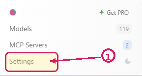
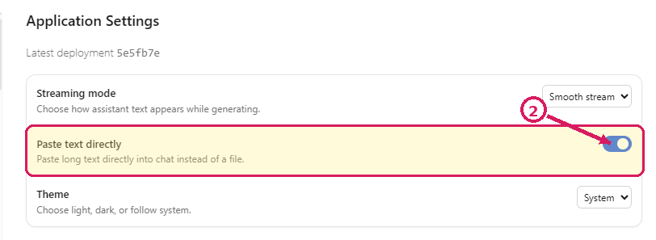
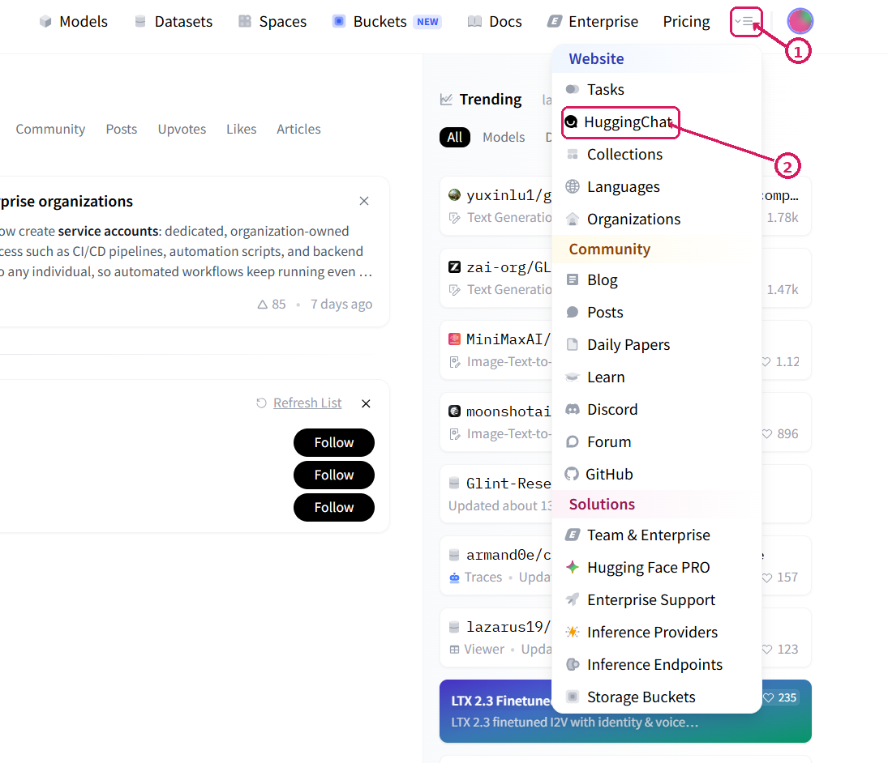

---
format:
  html:
    toc: true
    embed-resources: true
    code-copy: true
---

```{=html}
<style>
/* Make prompt/code boxes wrap instead of requiring horizontal scrolling */
pre,
pre code,
div.sourceCode,
div.sourceCode pre,
div.sourceCode code {
  white-space: pre-wrap !important;
  overflow-wrap: anywhere;
  word-break: normal;
}

/* Keep the prompt boxes readable */
pre,
div.sourceCode {
  border: 1px solid #d0d7de;
  border-radius: 6px;
  padding: 1rem;
  background-color: #f6f8fa;
  overflow-x: hidden;
}

/* Leave room for Quarto's copy button */
pre {
  position: relative;
}

/* Slightly improve spacing between headings and scenario lines */
h3 {
  margin-bottom: 0.85rem;
}

h3 + p {
  margin-top: 0;
}
</style>
```
# Tutorial: *How to handle LLMs in your research*

*For the Department of Interdisciplinary Social Science*

**Course coordinators:** Ayoub Bagheri, Pablo Mosteiro (Department of Methodology and Statistics)

**Duration:** 1 hour

*Parts of this tutorial were drafted with assistance from Qwen/Qwen2.5-7B-Instruct and moonshotai/Kimi-K2-Instruct-0905 via HuggingChat, using Together and Groq as providers. The examples are fictional and were generated with GPT-5.5.*

## Learning objectives

By the end of this tutorial, you will be able to:

1. Set up an account on a privacy-conscious LLM platform.
2. Use LLMs for common research tasks, including:
   - extracting relevant information from text,
   - coding, classifying, or annotating text,
   - summarizing or comparing research material.
3. Understand model limitations through exercises.

---

## Part 1: Setting up HuggingChat

1. Go to [HuggingChat](https://huggingface.co/chat/models/Qwen/Qwen3.6-27B).
2. Click **Sign in with Hugging Face**.
3. Create a free account or sign in with an existing account.
4. If you are redirected to the HuggingFace homepage after creating your account, open the link in step 1 again to start a chat with Qwen3.6-27B. You can select a different model by clicking the model name at the top of the chat.
5. Click **Settings** in the bottom-left menu and enable **Paste text directly**.
6. For each activity below, copy the prompt from the text box and paste it into your HuggingChat conversation. If the prompt contains a placeholder such as `[INSERT TEXT HERE]`, replace it before sending.

**Why HuggingChat?** Hosts open models such as Llama, Mistral, and Qwen, and does not train models on your conversations.

---

## Part 2: Example applications in research

### Example 1: Extract information from text

**Scenario:** You want to extract relevant information from interviews.

Copy this prompt to HuggingChat:

```default
You are assisting with qualitative analysis of interview excerpts.

Analysis instructions:
The interview study concerns researchers' understandings and experiences of interdisciplinary work. Extract information that is relevant to:
- definitions of interdisciplinarity,
- examples of interdisciplinary work,
- benefits of interdisciplinary work,
- challenges of interdisciplinary work,
- dilemmas or contradictions in how participants discuss interdisciplinary work.

Interview excerpts:

Excerpt 1:
"Well, I'll start by saying that I do have some experience of doing research with people from other disciplines, but never in my life have I used all these terms so often. Uh, as I do here because, um, also kind of a disclaimer, uh, I, I feel like this is a very European thing. The interdisciplinarity, like this obsession with, like, crossing boundaries. Um, in my experience. So I did, uh, my graduate studies in the US, and it was a very disciplinary kind of, uh, siloed, even, uh, system because you were educated in your discipline. You probably also did most of your research with people from your discipline. And it was kind of, uh, an exception if you did cross the boundaries. But here everyone is doing it so seamlessly, I feel like, and it's just a requirement. And people do think about it a lot, what it means. So I also started thinking about it, and then I realized that I actually do have the experience, which maybe I could reflect on better if I knew about all these, you know, discussions around interdisciplinarity, multi disciplinary, disciplinary or what have you. So. Now I know that. Interdisciplinarity. Mostly people use it to refer to research within academia. But like crossing disciplinary boundaries. But transdisciplinary means something else that you work with partners outside of academia, I guess, which is also new to me."

Excerpt 2:
"And this is what is new to me. So I try to be careful when I when I say it, but also it comes from my experience of being trained in a particular tradition. You know, like a discipline has a method. A discipline has like its lingo. Yeah. So when you just change all that for interdisciplinary social science as a discipline, then it also kind of has its own core. It has its own lingo. But is it then a discipline that's called interdisciplinary social science or is it interdisciplinary social science?"

Excerpt 3:
"Well, I actually I think interdisciplinary or transdisciplinary research, I think it's the only way forward. If you talk about really big societal problems because, these issues like climate change or inequality. These have so many aspects and underlying causes. And so I think to really understand then what's going on and to do something about it, you really need each other because you cannot solve these big problems just with one discipline. It's just impossible, I think. I do think it's still valuable also to do disciplinary research, to focus on a certain aspect of that bigger problem and really try to understand the nitty gritty things going on there. But for finding solutions to big problems, I think you then still again need to combine all these perspectives or insights to find the solutions that have the potential to work. And I think also to then, later, implement solutions, you also need to have had all these actors already at the table from the start, because then people feel like they had a say, and they also feel kind of involved... I think they are more inclined to also then act. Instead of that, you would just come up to them at some point and say, hey, we have figured it out, you need to do this. Then people are like, oh, who are you then? Compared to when they would have been involved from the start. And for me personally, I just also really like to hear how other people think, because I'm so aware that my perspective or my opinion is just one of the many perspectives. And I always find it inspiring to hear like: right, you can also approach it that way and see it that way. And so yeah, for me, it's just a really nice way of working and doing research."

Provide:
1. Definitions or understandings of interdisciplinarity mentioned by the participant.
2. Examples of interdisciplinary or transdisciplinary work.
3. Benefits of interdisciplinary work.
4. Challenges, tensions, or dilemmas.
5. Contradictions or ambivalences in how the participant talks about interdisciplinarity.
6. Exact quotes that support each point.
7. Any uncertainty, ambiguity, or missing context.

Stay close to the excerpts. Do not impose a theory of interdisciplinarity that is not present in the text. Mark uncertain interpretations clearly.
```

**Task:** Use the [BRAVE(R)](#braver) framework to analyze the prompt, then use the [FACTS](#facts) framework to analyze the response. Discuss your evaluation with a classmate.

*Note: LLMs can also help you build and refine prompts.*

#### Reflection

1. Did the model distinguish definitions, examples, benefits, challenges, and dilemmas?
2. Did it use exact quotes from the interview excerpts?
3. Did it identify ambiguity or ambivalence without over-interpreting?
4. Did it add claims about interdisciplinarity that were not in the excerpts?

---

### Example 2: Code, annotate or classify text

**Scenario:** You need to code qualitative interview excerpts using a predefined codebook, while still allowing room for inductive themes.

Copy this prompt to HuggingChat:

```default
You are assisting with qualitative coding of interview excerpts.

Coding instructions:
Code the excerpts using the codebook below. The analysis focuses on how researchers understand and experience interdisciplinary work.

Use the predefined codes where possible. If an important theme is clearly present but does not fit the codebook, suggest an inductive theme.

Codebook:

Definitions and understandings of interdisciplinarity:
- DEF_BOUNDARY_CROSSING: Interdisciplinarity is described as crossing boundaries between academic disciplines.
- DEF_TRANSDISCIPLINARY_EXTERNAL_ACTORS: Transdisciplinarity is described as involving partners or actors outside academia.
- DEF_DISCIPLINE_WITH_METHOD_LINGO: A discipline is described as having its own methods, language, traditions, or training.
- DEF_ISW_AS_DISCIPLINE_OR_NOT: The participant questions whether interdisciplinary social science is itself a discipline.

Benefits of interdisciplinary work:
- BEN_COMPLEX_PROBLEMS: Interdisciplinary work is presented as necessary for understanding complex societal problems.
- BEN_BETTER_SOLUTIONS: Combining perspectives is presented as useful for developing solutions.
- BEN_IMPLEMENTATION_AND_BUY_IN: Involving actors early is presented as helpful for later implementation or acceptance.
- BEN_LEARNING_FROM_PERSPECTIVES: The participant values hearing or learning from other perspectives.

Challenges of interdisciplinary work:
- CHA_TERMINOLOGY_CONFUSION: The participant expresses uncertainty about terms such as interdisciplinary, multidisciplinary, or transdisciplinary.
- CHA_DISCIPLINARY_SILOS: The participant describes disciplinary training or research environments as siloed.
- CHA_INSTITUTIONAL_PRESSURE: Interdisciplinarity is described as an expectation, requirement, or institutional norm.
- CHA_COORDINATION_OR_ACTOR_INVOLVEMENT: The participant implies that collaboration requires coordination across people, disciplines, or actors.

Dilemmas and contradictions:
- DIL_DISCIPLINARY_DEPTH_VS_INTEGRATION: The participant values disciplinary depth while also arguing that broader problems require combining perspectives.
- DIL_INTERDISCIPLINARITY_AS_CHOICE_VS_REQUIREMENT: Interdisciplinary work is presented both as valuable and as something expected or required.
- DIL_INTERDISCIPLINARITY_AS_ANTI_DISCIPLINE_VS_OWN_DISCIPLINE: Interdisciplinary social science is discussed as both crossing disciplines and possibly becoming a discipline with its own core.
- DIL_CONCEPTUAL_BLURRING: The participant uses or discusses related terms in a way that shows uncertainty, overlap, or ambiguity.

Other:
- IND_OTHER: Use this only when an important theme is clearly present but does not fit the codebook. Name the suggested inductive theme.
- UNCLEAR: Use this when the excerpt does not clearly support another code.

Interview excerpts:

Excerpt 1:
"Well, I'll start by saying that I do have some experience of doing research with people from other disciplines, but never in my life have I used all these terms so often. Uh, as I do here because, um, also kind of a disclaimer, uh, I, I feel like this is a very European thing. The interdisciplinarity, like this obsession with, like, crossing boundaries. Um, in my experience. So I did, uh, my graduate studies in the US, and it was a very disciplinary kind of, uh, siloed, even, uh, system because you were educated in your discipline. You probably also did most of your research with people from your discipline. And it was kind of, uh, an exception if you did cross the boundaries. But here everyone is doing it so seamlessly, I feel like, and it's just a requirement. And people do think about it a lot, what it means. So I also started thinking about it, and then I realized that I actually do have the experience, which maybe I could reflect on better if I knew about all these, you know, discussions around interdisciplinarity, multi disciplinary, disciplinary or what have you. So. Now I know that. Interdisciplinarity. Mostly people use it to refer to research within academia. But like crossing disciplinary boundaries. But transdisciplinary means something else that you work with partners outside of academia, I guess, which is also new to me."

Excerpt 2:
"And this is what is new to me. So I try to be careful when I when I say it, but also it comes from my experience of being trained in a particular tradition. You know, like a discipline has a method. A discipline has like its lingo. Yeah. So when you just change all that for interdisciplinary social science as a discipline, then it also kind of has its own core. It has its own lingo. But is it then a discipline that's called interdisciplinary social science or is it interdisciplinary social science?"

Excerpt 3:
"Well, I actually I think interdisciplinary or transdisciplinary research, I think it's the only way forward. If you talk about really big societal problems because, these issues like climate change or inequality. These have so many aspects and underlying causes. And so I think to really understand then what's going on and to do something about it, you really need each other because you cannot solve these big problems just with one discipline. It's just impossible, I think. I do think it's still valuable also to do disciplinary research, to focus on a certain aspect of that bigger problem and really try to understand the nitty gritty things going on there. But for finding solutions to big problems, I think you then still again need to combine all these perspectives or insights to find the solutions that have the potential to work. And I think also to then, later, implement solutions, you also need to have had all these actors already at the table from the start, because then people feel like they had a say, and they also feel kind of involved... I think they are more inclined to also then act. Instead of that, you would just come up to them at some point and say, hey, we have figured it out, you need to do this. Then people are like, oh, who are you then? Compared to when they would have been involved from the start. And for me personally, I just also really like to hear how other people think, because I'm so aware that my perspective or my opinion is just one of the many perspectives. And I always find it inspiring to hear like: right, you can also approach it that way and see it that way. And so yeah, for me, it's just a really nice way of working and doing research."

Provide a table with:
1. Excerpt number.
2. Text segment.
3. Assigned code or codes.
4. Exact supporting words.
5. Confidence: high, medium, or low.
6. Alternative possible code.
7. Brief justification.
8. Suggested inductive theme, if relevant.

Do not force a code when the evidence is weak. Mark ambiguity explicitly. Keep interpretations grounded in the excerpts.
```

**Task:** Use the [FACTS](#facts) framework to analyze the response. Discuss your evaluation with a classmate.

*Note: You can include a codebook in the prompt. Clearer definitions lead to more consistent outputs, and current LLMs can follow detailed instructions and output schemas.*

#### Reflection

1. Did the model apply the predefined codes consistently?
2. Did the model distinguish definitions, benefits, challenges, and dilemmas?
3. Did it identify dilemmas or contradictions rather than only listing positive and negative points?
4. Were any inductive themes genuinely grounded in the excerpts?
5. Did it preserve ambiguity where the excerpt was unclear?
6. Would another researcher be able to reproduce this coding from the same codebook?

---

### Example 3: Summarize or compare research

**Scenario:** You need to quickly understand whether an article is relevant to your research.

Find an abstract or a short article excerpt that you would like to summarize. Copy the prompt below into HuggingChat, replace `[INSERT TEXT HERE]` with your chosen text, and then send it.

```default
Summarize the research abstract below for an Interdisciplinary Social Science researcher deciding whether the article is relevant.

Abstract:
[INSERT ABSTRACT TEXT HERE]

Provide:
1. The main research question.
2. The social problem, population, or setting studied.
3. The study design and method.
4. The main findings.
5. Any findings relevant to youth, migration and cultural diversity, social policy, public health, inequality, discrimination, participation, or interdisciplinary research.
6. Limitations explicitly mentioned in the abstract.
7. Claims that require reading the full paper before trusting.
8. Three search terms for finding related work.

Use only information from the abstract. Do not invent sample details, measures, effect sizes, mechanisms, policy implications, or practical recommendations. Mark uncertain points clearly.
```

**Task:** Use the [FACTS](#facts) framework to analyze the response. Discuss your evaluation with a classmate.

#### Reflection

1. Did the model distinguish research question, method, findings, and limitations?
2. Did it avoid adding implications that were not in the abstract?
3. Did it identify what would require reading the full paper?
4. Would this help you decide whether the article is relevant to your work?

---

## Part 3: Understanding model limitations

### Exercise 1: Identifying hallucinations

**Task:** Ask the model to provide an overview of recent literature in a specific field. For example:

```default
What are the latest studies on interdisciplinary or transdisciplinary research for addressing institutional inequality, published in 2026?
```
Then check the answer against reliable external sources such as Google Scholar, Web of Science, Scopus, PubMed, or official project pages.

#### Reflection

1. Do the named studies, authors, journals, or projects actually exist?
2. Are the publication years and article titles correct?
3. Does the model confuse conceptual papers, empirical studies, reports, and opinion pieces?
4. Does it overstate what recent literature has established?
5. What wording would make the prompt safer and more precise?

Document any fabricated, unverifiable, or overstated claims.

---

### Exercise 2: Bias detection

**Task:** Compare responses to these two prompts:

**Prompt A:**    
```default
Describe the typical problems of interdisciplinary research.
```

**Prompt B:**    
```default
Describe the possible benefits, challenges, dilemmas, and institutional conditions of interdisciplinary research, while distinguishing disciplinary, interdisciplinary, multidisciplinary, and transdisciplinary work.
```

Pay attention to what the model treats as obvious, desirable, difficult, or problematic.

#### Reflection

1. What assumptions does the model make about disciplines and interdisciplinary work?
2. Does it treat interdisciplinarity as automatically better than disciplinary research?
3. Does it distinguish benefits, challenges, and dilemmas?
4. Does it define key terms carefully, or does it blur them together?
5. How could the prompt be revised to produce a more balanced and analytically useful response?

---

## Wrap-up: Your personal AI-use checklist

Create your own checklist:

- [ ] I will verify AI-generated facts.
- [ ] I will not input sensitive, confidential, or personally identifiable information.
- [ ] I will disclose AI assistance in my work.
- [ ] I will check citations and source claims manually.
- [ ] I will choose open-source models when possible.
- [ ] I will keep human oversight over critical decisions.

## Next steps

The tasks in this tutorial can also be applied and automated at larger scale through API-based workflows.

The Department of Methodology and Statistics provides consultation on AI use in research: [Consultation Data Science / AI](https://www.uu.nl/en/organisation/methodology-and-statistics/training-and-support/consultation-data-science-ai)

## Quick reference: BRAVE(R) and FACTS {#braver-facts-reference}

Use BRAVE(R) when formulating or improving a prompt. Use FACTS when evaluating an AI-generated response.


### BRAVE(R) {#braver}
+--------------------+----------------------------------------------------------+
| **B: Boundaries**  | Set limits on the format, length, or any other           |
|                    | constraints.                                             |
+--------------------+----------------------------------------------------------+
| **R: Role**        | Identify the role or perspective you want the AI tool    |
|                    | to take.                                                 |
+--------------------+----------------------------------------------------------+
| **A: Audience**    | Specify who the output is intended for to determine the  |
|                    | appropriate tone and style.                              |
+--------------------+----------------------------------------------------------+
| **V: Variables**   | Highlight key details, variables, or points that should  |
|                    | be included in the response.                             |
+--------------------+----------------------------------------------------------+
| **E: Expectations**| Clearly state what you expect the AI to accomplish,      |
|                    | including the intended outcome and purpose.              |
+--------------------+----------------------------------------------------------+
| **R: Refine**      | Provide feedback to improve the output and guide future  |
|                    | interactions.                                            |
+--------------------+----------------------------------------------------------+\

\

### FACTS {#facts}
+---------------------+---------------------------------------------------------+
| **F: Focus**        | Focus on the AI's response by breaking it down into its |
|                     | main points and arguments.                              |
+---------------------+---------------------------------------------------------+
| **A: Authenticate** | Authenticate the AI's output by verifying it against    |
|                     | current research and empirical data.                    |
+---------------------+---------------------------------------------------------+
| **C: Critique**     | Critique the response's accuracy, relevance, and depth   |
|                     | in the context of the topic.                            |
+---------------------+---------------------------------------------------------+
| **T: Think**        | Think about the response from different perspectives    |
|                     | and consider its potential impact.                      |
+---------------------+---------------------------------------------------------+
| **S: Scrutinise**   | Scrutinise the AI's conclusions by critically           |
|                     | questioning them and exploring alternative hypotheses   |
|                     | or interpretations.                                     |
+---------------------+---------------------------------------------------------+

## Troubleshooting HuggingChat {#troubleshooting}

<details>
<summary><strong>A pasted prompt appears as “clipboard content” or cannot be sent</strong></summary>

HuggingChat may treat a long pasted prompt as an attached file. To paste it directly into the message box:

1. Click **Settings** in the bottom-left menu.

{width=50% fig-align="center"}

2. Enable **Paste text directly** under **Application Settings**.

{width=95% fig-align="center"}

Paste the prompt again after enabling the setting.

</details>

<details>
<summary><strong>You are redirected to the HuggingFace homepage after signing in</strong></summary>

Open the menu in the top-right corner and select **HuggingChat**.

{width=100% fig-align="center"}

You can also open [HuggingChat with Qwen3.6-27B](https://huggingface.co/chat/models/Qwen/Qwen3.6-27B) directly.

</details>

<details>
<summary><strong>The model remains stuck on “Reasoning,” becomes unavailable, or stops responding</strong></summary>

Try the following steps in order:

1. Stop the response, if the stop button is available, and send the prompt again.
2. Refresh the page or start a new conversation.
3. Select a different model by clicking the model name at the top of the chat.
4. If the problem continues, use one of the alternative platforms listed below.

Copy your prompt before refreshing the page or changing platforms.

</details>

<details>
<summary><strong>HuggingChat says that a usage or rate limit has been reached</strong></summary>

You can complete the exercises on another platform. Free alternatives include:

- [Duck.ai](https://duck.ai/) hosts several models, GPT-OSS-120B is recommended for these exercises.
- [Qwen Chat](https://chat.qwen.ai/) hosts Qwen models.
- [Z.ai Chat](https://chat.z.ai/) hosts GLM models.
- [Le Chat by Mistral AI](https://chat.mistral.ai/chat) provides access to its basic model without an account.

You can also use a proprietary chat assistant:

- [Gemini](https://gemini.google.com/app)
- [ChatGPT](https://chatgpt.com/)

</details>

<details>
<summary><strong>How should I choose a model?</strong></summary>

As a rule of thumb, newer and larger models tend to perform better. Open models often report their size in the model name. For example, the **27B** in Qwen3.6-27B means that the model has approximately 27 billion parameters.

Version numbers can also indicate recency, but only within the same model family. For example, GLM-5.2 is newer than GLM-5. However, version numbers are not comparable across families: GLM-4 is not older than Qwen3.6. Models from the same generation and size range often perform similarly on general tasks, although some are stronger in particular languages, coding, reasoning, or multimodal tasks. You can search online for benchmarks on various tasks.

These are some of the established current open model families:

* Alibaba's **Qwen 3.6**
* Z.ai's **GLM 5**
* Google's **Gemma 4**

The newest and largest models perform the best, but they are not always the right tool for every task. They generally respond more slowly, require a lot more computing power, and use more of your token budget when accessed through platforms such as HuggingChat. A practical approach is to decide on the acceptable level of performance for your task and use the smallest model that meets it. 

**A note on Mixture-of-Experts models**

Not every number in a model name refers to the same thing. A conventional, or *dense*, model uses approximately all of its parameters when generating each token. A **Mixture-of-Experts (MoE)** model contains several specialised groups of parameters, called experts, but activates only a subset of them at a time. This reduces the computation needed for each response, although the complete model still has to be stored in memory.

For example:

* **Llama-4-Scout-17B-16E** has 16 experts, approximately 17 billion active parameters, and 109 billion parameters in total.
* **Qwen3.6-35B-A3B** has 35 billion parameters in total but activates approximately 3 billion at a time. Here, **A3B** means 3 billion active parameters.

Developers are constantly experimenting with different architectures, for example, in **Gemma 4 E2B**, the **E** means *effective*. The model has approximately 2.3 billion effective parameters, but around 5.1 billion parameters when its embedding tables are included. This is an efficiency technique rather than a Mixture-of-Experts architecture.

The naming conventions are not fully standardised, so check the model card when the numbers are unclear.

**A note on quantization**

Open models are also frequently modified to make them smaller and easier to run. The most common method is **quantization**, which stores model weights at a lower numerical precision.

Models are commonly released in formats such as **floating point 32 (FP32**), **FP16**, or **BF16**. Quantized versions may instead use **FP8**, **INT8**, **INT4**, or labels such as **Q4**, **Q5**, **Q6**, and **Q8**. These numbers refer roughly to how many bits are used to represent each weight.

Lower-bit quantization reduces memory use and may make the model faster, but more aggressive quantization can also reduce output quality. Eight-bit and FP8 versions often remain close to the original model, while six-bit and four-bit versions can still work well depending on the model and task. Very low-bit versions involve a greater trade-off.

When using HuggingChat, you generally do not need to choose a quantization yourself. This becomes more relevant when running it locally.

</details>