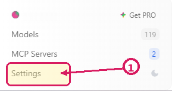
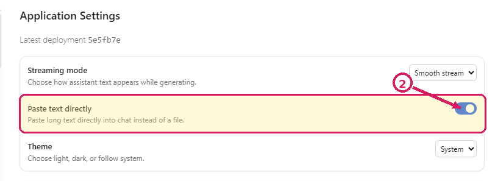
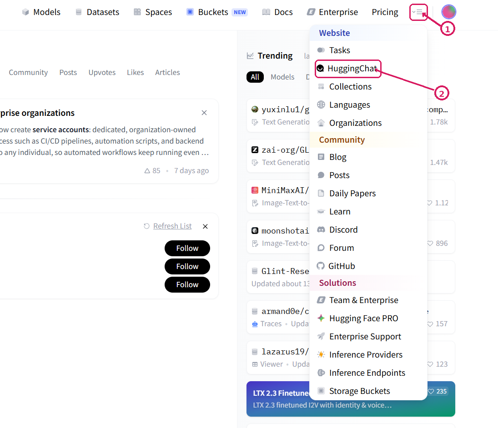

# Tutorial: *How to handle LLMs in your research*

*For the Department of Youth & Family*

**Course coordinators:** Robert Bagheri, Pablo Mosteiro, Ozgur Togay (Department of Methodology, Statistics and Data Science)

**Duration:** 1 hour

*This tutorial was drafted with assistance from GPT-5.6-Sol. All examples below are AI generated.*

## Learning objectives

By the end of this tutorial, you will be able to:

1. Choose an AI chat platform and model appropriate for your task.
2. Use LLMs for common research tasks, including:
   - extracting relevant information from text,
   - coding, classifying, or annotating text,
   - summarizing or comparing research material.
3. Understand model limitations through exercises.

---

## Part 1: Choose an AI chat platform and model

For the exercises below, choose one of the privacy-conscious platforms in the table. If you are working in a pair or group, try different models and compare the outputs. If you already use another chat-based GenAI system, such as ChatGPT or Claude, feel free to use that instead.

*When comparing outputs from different platforms, keep in mind that differences may come from the platform as well as the underlying model.*

| **Feature** | [**HuggingChat**](#use-huggingchat) | [**Duck.ai**](#use-duckai) | [**Lumo**](#use-lumo) |
|---|---|---|---|
| **Sign-up** | Free account required | Not required | Not required |
| **Model choice** | Many open models | Few open and proprietary models | Automatic model assignment |
| **Privacy** | No training on user data; retention policies may vary | No training on user data; no retention | No training on user data; no retention, hosted in the EU |
| **File support** | No PDFs; text and images vary by model | PDFs up to 15 pages, text and images | PDFs, large documents, text and images |

<details id="use-huggingchat">
<summary><strong>Use HuggingChat</strong></summary>

1. Choose one of the suggested models:
   - **Small:** [Qwen 3.5 9B](https://huggingface.co/chat/models/Qwen/Qwen3.5-9B), [IBM Granite 4.2 3B](https://huggingface.co/chat/models/ibm-granite/granite-4.2-3b) (*XSmall*), [Llama 3.1 8B](https://huggingface.co/chat/models/meta-llama/Llama-3.1-8B-Instruct) (*outdated*)
   *Llama 3.1 is included as an older example to show how quickly models have advanced.*
   - **Medium:** [Qwen 3.8 27B](https://huggingface.co/chat/models/Qwen/Qwen3.8-27B) (*Great baseline, can be run locally*), [Muse Glimmer 30B](https://huggingface.co/chat/models/meta-models/Muse-Glimmer-30B), [Gemma 4 31B](https://huggingface.co/chat/models/google/gemma-4-31B-it)
   - **State-of-the-art:** [GLM 5.3 744B](https://huggingface.co/chat/models/zai-org/GLM-5.3), [Kimi K3](https://huggingface.co/chat/models/moonshotai/Kimi-K3), [DeepSeek V4 Flash](https://huggingface.co/chat/models/deepseek-ai/DeepSeek-V4-Flash-0731) (Note: These models will consume your usage limits quickly, but they provide performance akin to flagship proprietary models such as GPT-5.6-Sol and Claude Opus)
2. Click **Sign in with Hugging Face**.
3. Create a free account or sign in with an existing account.
4. If you are redirected to the Hugging Face homepage after creating your account, return to chat with the model link above.
5. Click **Settings** in the bottom-left menu and enable **Paste text directly**.
6. You can change models at any time by clicking the model name at the top of the chat.

</details>

<details id="use-duckai">
<summary><strong>Use Duck.ai</strong></summary>

1. Go to [Duck.ai](https://duck.ai/). No account is required.
2. Click the current model name in the sidebar to select a model. For this tutorial, you could try:
   - **Open medium:** Gemma 4 31B
   - **Large open:** gpt-oss 120B, Mistral Small 4
   - **Efficient proprietary:** GPT-5.4 mini
   - **Large proprietary:** GPT-5.6 Luna
3. You can attach a PDF or other supported file directly to the conversation.

*Most proprietary models do not share their parameter sizes, so size-based comparisons are less straightforward.*

</details>

<details id="use-lumo">
<summary><strong>Use Lumo</strong></summary>

1. Go to [Lumo](https://lumo.proton.me/). You can start a chat as a guest without creating an account.
2. Click the current version name in the bottom-right to change between Lite and Max processing, which automatically changes the backend model.
3. You can upload PDFs and other supported documents directly to the conversation.

</details>

As a rule of thumb, newer and larger models tend to perform better, but they also use more computing resources and may reach usage limits faster. When working in a group, comparing models of different sizes or from different developers can help you see how much the choice of model affects the result. More detail is available in the [model-selection reference](#model-selection-reference).

## Part 2: Example applications in research

### Example 1: Extract information from text {.unnumbered .unlisted}

**Scenario:** You have an interview excerpt about an adolescent's experiences of parental involvement, privacy, and autonomy.

Copy this prompt to your AI chat:

```default
Extract the key information from the interview excerpt below.

Interview excerpt:
"I usually tell my mum where I'm going and who I'm with. Most of the time I don't mind because she doesn't make a big thing out of it. If she keeps asking questions after I've already told her, though, then I sometimes just stop saying things. It feels different when I choose to tell her than when I feel like I have to."

Provide:
1. Examples of voluntary disclosure or concealment.
2. How the adolescent describes parental involvement and autonomy.
3. Exact words or phrases that support each point.
4. Any tension, ambiguity, or missing context.
5. What would need manual verification before using the interpretation in research.

Stay close to the excerpt. Do not infer motives or causal relationships that are not stated. Mark uncertain interpretations clearly.
```

**Task:** Use the [BRAVE(R)](#braver) framework to analyze the prompt, then use the [FACTS](#facts) framework to analyze the response. Discuss your evaluation with a classmate.

*Note: LLMs can also help you build and refine prompts.*

#### Reflection

1. Did the model distinguish voluntary disclosure from information given because of parental pressure?
2. Did it use evidence from the excerpt?
3. Did it preserve ambiguity rather than over-interpreting the adolescent's experience?
4. Did it add motives or causal explanations that were not stated?

---

### Example 2: Code, annotate or classify text {.unnumbered .unlisted}

**Scenario:** You need to code an interview response about parent-adolescent communication and autonomy using a predefined codebook.

Copy this prompt to your AI chat:

```default
Code the following interview excerpt using the codebook below.

Interview excerpt:
"My parents have rules about when I need to be home and how late I can use my phone on school nights. Sometimes I actually think the rules help, especially when I have an exam. But when they just say no without explaining why, I get annoyed. I want them to trust that I can decide some things myself."

Codebook:
- AUTONOMY: The adolescent describes wanting, receiving, or exercising independence or decision-making freedom.
- PARENTAL_RULES_OR_MONITORING: The parent sets rules, asks for information, checks behaviour, or otherwise monitors the adolescent.
- AUTONOMY_SUPPORT: The parent allows choice, explains decisions, gives increasing freedom, or shows trust in the adolescent's ability to decide.
- TRUST: Trust between the adolescent and parent is explicitly mentioned or clearly described.
- CONFLICT_OR_TENSION: The adolescent describes disagreement, irritation, pressure, or conflict with a parent.
- AMBIGUOUS_OR_INSUFFICIENT: Use when the excerpt does not clearly support another code.

Provide a table with:
1. Text segment.
2. Assigned code or codes.
3. Exact supporting words.
4. Confidence: high, medium, or low.
5. Brief justification.
6. Alternative possible code, if relevant.

Do not force a code when the evidence is weak. Mark ambiguity explicitly.
```

**Task:** Use the [FACTS](#facts) framework to analyze the response. Discuss your evaluation with a classmate.

*Note: You can include a codebook in the prompt. Clearer definitions lead to more consistent outputs, and current LLMs can follow detailed instructions and output schemas.*

#### Reflection

1. Did the model apply the codebook consistently?
2. Did it distinguish parental rules or monitoring from autonomy support?
3. Did it assign multiple codes where appropriate?
4. Did it over-interpret the excerpt or force a code where evidence was weak?

---

### Example 3: Summarize or compare research {.unnumbered .unlisted}

**Scenario:** You need to quickly understand whether a scientific paper is relevant to your research on youth and families.

Find an abstract or a short article excerpt that you would like to summarize. Copy the prompt below into your AI chat, replace `[INSERT TEXT HERE]` with your chosen text, and then send it.

```default
Summarize the research abstract below for a Youth & Family researcher deciding whether the article is relevant.

Abstract:
[INSERT ABSTRACT TEXT HERE]

Provide:
1. The main research question.
2. The population and setting studied.
3. The study design and method.
4. The main concepts or variables studied and, if stated, how they were operationalized or measured.
5. The main findings.
6. Implications explicitly stated in the abstract.
7. Limitations explicitly stated in the abstract.
8. Important questions that would require reading the full paper.
9. Three search terms for finding related work.

Use only information from the abstract. Do not invent sample details, measures, effect sizes, mechanisms, limitations, or practical recommendations. Mark uncertain points clearly.
```

**Task:** Use the [FACTS](#facts) framework to analyze the response. Discuss your evaluation with a classmate.

#### Reflection

1. Did the model distinguish the research question, population, method, concepts, and findings?
2. Did it correctly separate information stated in the abstract from information that would require reading the full paper?
3. Did it avoid inventing details about measures, mechanisms, limitations, or implications?
4. Would this summary help you decide whether the article is relevant to your research?

#### Go further: Ask your own questions about research {.unnumbered .unlisted}

So far, the examples have given you a specific prompt and task. Now, create your own.

Keeping what you have learned so far in mind, choose one or more scientific papers relevant to your research and formulate a question you would genuinely like to ask about them. Depending on the platform, you can upload the papers directly or provide links to openly accessible papers.

For example, you could ask about:

- how a particular concept is defined or operationalized in a paper;
- how methodology differs between papers;
- similarities or differences in how studies approach the same research question;
- how findings across several papers could be synthesized;
- an unfamiliar method, theory, or result;
- anything else that would be useful for your own research.

Try to formulate the prompt yourself rather than copying one of the examples above. Keep [BRAVE(R)](#braver) and [FACTS](#facts) in mind when writing your question and evaluating the response.

**Task:** Ask your question and inspect the response. Then continue the conversation with at least one follow-up question. For example, ask the model to clarify something, provide evidence from the papers, compare one aspect in more detail, or reconsider part of its interpretation.

---

## Part 3: Understanding model limitations

### Exercise 1: Bias detection {.unnumbered .unlisted}

**Task:** Compare responses to these two prompts:

**Prompt A:**
```default
Explain why parental monitoring can undermine adolescent autonomy.
```

**Prompt B:**
```default
Explain how parental monitoring may relate to adolescent autonomy. Consider possible positive, negative, null, bidirectional, and context-dependent relationships. Distinguish parental monitoring from adolescents' voluntary disclosure and from parental privacy invasion.
```

Compare what the model presents as established, what mechanisms it assumes, and how much uncertainty it allows in each response.

#### Reflection

1. How did the framing of the question affect the model's conclusions?
2. Did Prompt A encourage the model to accept the proposed relationship rather than evaluate it?
3. Did Prompt B produce a more nuanced answer, or did it simply list possibilities without evaluating them?
4. Did the model distinguish parental monitoring, voluntary disclosure, and privacy invasion?
5. Did either response make causal claims without evidence?
6. How could you formulate the question to reduce leading assumptions while keeping it useful for your own research?


---

## Wrap-up: Your personal AI-use checklist

Create your own checklist:

- [ ] I will verify AI-generated facts.
- [ ] I will not input sensitive, confidential, or personally identifiable information.
- [ ] I will disclose AI assistance in my work.
- [ ] I will check citations and source claims manually.
- [ ] I will choose open-source models when possible.
- [ ] I will keep human oversight over critical decisions.

## Next steps

The tasks in this tutorial can also be applied and automated at larger scale through API-based workflows.

The Department of Methodology, Statistics and Data Science provides consultation on AI use in research: [Consultation Data Science / AI](https://www.uu.nl/en/organisation/methodology-and-statistics/training-and-support/consultation-data-science-ai)

## Quick reference: BRAVE(R) and FACTS {#braver-facts-reference}

Use BRAVE(R) when formulating or improving a prompt. Use FACTS when evaluating an AI-generated response.


### BRAVE(R) {#braver .unnumbered .unlisted}
+--------------------+----------------------------------------------------------+
| **B: Boundaries**  | Set limits on the format, length, or any other           |
|                    | constraints.                                             |
+--------------------+----------------------------------------------------------+
| **R: Role**        | Identify the role or perspective you want the AI tool    |
|                    | to take.                                                 |
+--------------------+----------------------------------------------------------+
| **A: Audience**    | Specify who the output is intended for to determine the  |
|                    | appropriate tone and style.                              |
+--------------------+----------------------------------------------------------+
| **V: Variables**   | Highlight key details, variables, or points that should  |
|                    | be included in the response.                             |
+--------------------+----------------------------------------------------------+
| **E: Expectations**| Clearly state what you expect the AI to accomplish,      |
|                    | including the intended outcome and purpose.              |
+--------------------+----------------------------------------------------------+
| **R: Refine**      | Provide feedback to improve the output and guide future  |
|                    | interactions.                                            |
+--------------------+----------------------------------------------------------+\

\

### FACTS {#facts .unnumbered .unlisted}
+---------------------+---------------------------------------------------------+
| **F: Focus**        | Focus on the AI's response by breaking it down into its |
|                     | main points and arguments.                              |
+---------------------+---------------------------------------------------------+
| **A: Authenticate** | Authenticate the AI's output by verifying it against    |
|                     | current research and empirical data.                    |
+---------------------+---------------------------------------------------------+
| **C: Critique**     | Critique the response's accuracy, relevance, and depth   |
|                     | in the context of the topic.                            |
+---------------------+---------------------------------------------------------+
| **T: Think**        | Think about the response from different perspectives    |
|                     | and consider its potential impact.                      |
+---------------------+---------------------------------------------------------+
| **S: Scrutinise**   | Scrutinise the AI's conclusions by critically           |
|                     | questioning them and exploring alternative hypotheses   |
|                     | or interpretations.                                     |
+---------------------+---------------------------------------------------------+

## Additional resources

### Choosing a model {#model-selection-reference}

<details>
<summary><strong>How do model size and architecture affect model choice?</strong></summary>

As a rule of thumb, newer and larger models tend to perform better. Open models often report their size in the model name. For example, the **27B** in Qwen3.8-27B means that the model has approximately 27 billion parameters.

Version numbers can also indicate recency, but only within the same model family. For example, GLM-5.2 is newer than GLM-5. However, version numbers are not comparable across families: GLM-4 is not newer than Qwen3.8. Models from the same generation and size range often perform similarly on general tasks, although some are stronger in particular languages, coding, reasoning, or multimodal tasks. You can search online for benchmarks on various tasks.

These are some of the established current open model families:

* Alibaba's **Qwen**
* Z.ai's **GLM**
* Google's **Gemma**

The newest and largest models perform the best, but they are not always the right tool for every task. They generally respond more slowly, require a lot more computing power, and use more of your token budget when accessed through platforms such as HuggingChat. A practical approach is to decide on the acceptable level of performance for your task and use the smallest model that meets it. 

**A note on Mixture-of-Experts models**

Not every number in a model name refers to the same thing. A conventional, or *dense*, model uses approximately all of its parameters when generating each token. A **Mixture-of-Experts (MoE)** model contains several specialised groups of parameters, called experts, but activates only a subset of them at a time. This reduces the computation needed for each response, although the complete model still has to be stored in memory.

For example:

* **Llama-4-Scout-17B-16E** has 16 experts, approximately 17 billion active parameters, and 109 billion parameters in total.
* **Qwen3.6-35B-A3B** has 35 billion parameters in total but activates approximately 3 billion at a time. Here, **A3B** means 3 billion active parameters.

Developers are constantly experimenting with different architectures, for example, in **Gemma 4 E2B**, the **E** means *effective*. The model has approximately 2.3 billion effective parameters, but around 5.1 billion parameters when its embedding tables are included. This is an efficiency technique rather than a Mixture-of-Experts architecture.

The naming conventions are not fully standardised, so check the model card when the numbers are unclear.

**A note on quantization**

Open models are also frequently modified to make them smaller and easier to run. The most common method is **quantization**, which stores model weights at a lower numerical precision.

Models are commonly released in formats such as **floating point 32 (FP32**), **FP16**, or **BF16**. Quantized versions may instead use **FP8**, **INT8**, **INT4**, or labels such as **Q4**, **Q5**, **Q6**, and **Q8**. These numbers refer roughly to how many bits are used to represent each weight.

Lower-bit quantization reduces memory use and may make the model faster, but more aggressive quantization can also reduce output quality. Eight-bit and FP8 versions often remain close to the original model, while six-bit and four-bit versions can still work well depending on the model and task. Very low-bit versions involve a greater trade-off.

When using HuggingChat, you generally do not need to choose a quantization yourself. This becomes more relevant when running it ***locally***.

</details>


### Example from research: LLM-assisted data annotation {#data-annotation-example}

<details>
<summary><strong>View the research prompt</strong></summary>

LLMs are increasingly used for data annotation because they can make large-scale coding faster and cheaper. Performance still depends on the task, but recent work has found that LLMs can match or outperform human annotators on some social-science text classification tasks (Törnberg, 2024).[^annotation-performance]

The example below comes from [Togay et al. (2026)](https://arxiv.org/abs/2603.23531), which used LLMs to identify the political target and stance in Reddit comments across 138 predefined political targets plus an open-ended category. The best-performing models were comparable to highly trained human annotators.[^target-stance-paper]

This is deliberately much longer than the tutorial prompts above. Research annotation prompts can function like codebooks: they define labels, edge cases, output formats, and examples so that the same rules can be applied consistently across many observations. This prompt was also designed for an earlier generation of models; repeated emphasis such as `**...**` was used to reinforce important instructions and is generally not necessary with newer models.

[^annotation-performance]: Törnberg, P. (2024). *Large Language Models Outperform Expert Coders and Supervised Classifiers at Annotating Political Social Media Messages*. Social Science Computer Review. https://doi.org/10.1177/08944393241286471
[^target-stance-paper]: Togay, Ö., Garcia-Bernardo, J., Kunneman, F., & Giachanou, A. (2026). *Large Language Models Unpack Complex Political Opinions through Target-Stance Extraction*. arXiv:2603.23531. https://doi.org/10.48550/arXiv.2603.23531

<pre class="annotation-prompt"><code>You will be provided with a Reddit comment and the title of the submission under which it was posted&#46;&#13;&#10;&#13;&#10;Your task is to identify the &#42;&#42;target&#42;&#42; and the &#42;&#42;stance&#42;&#42; expressed toward it in the Comment&#44; using the predefined list of political targets at the end&#46;&#13;&#10;&#13;&#10;Only classify stances related to a target from the list&#46; If the Comment refers to a similar target with different wording&#44; select the exact matching entry from the list&#46;  &#13;&#10;&#42;&#42;Do not rename&#44; paraphrase&#44; or invent new target names&#46;&#42;&#42;  &#13;&#10;&#45; If the post refers to a target not on the list&#44; label it &#42;&#42;&#34;Other&#34;&#42;&#42;&#46;  &#13;&#10;&#45; If no political target is mentioned&#44; label it &#42;&#42;&#34;None&#34;&#42;&#42;&#46;  &#13;&#10;&#13;&#10;Use the Submission &#42;&#42;only&#42;&#42; to resolve ambiguity &#40;e&#46;g&#46;&#44; resolving pronouns or vague references&#41;&#46; &#42;&#42;Do not infer stance from the Submission&#46;&#42;&#42;&#13;&#10;&#13;&#10;&#45;&#45;&#45;&#13;&#10;&#13;&#10;&#35;&#35; Classification Steps&#13;&#10;&#13;&#10;1&#46; &#42;&#42;Identify the Political Target&#42;&#42;  &#13;&#10;   &#45; Choose a target from the predefined list at the end&#46;  &#13;&#10;   &#45; If the post refers to a target not on the list&#44; label it &#42;&#42;&#34;Other&#34;&#42;&#42;&#46;  &#13;&#10;   &#45; If no target is mentioned&#44; label it &#42;&#42;&#34;None&#34;&#42;&#42; and skip stance classification&#46;&#13;&#10;&#13;&#10;2&#46; &#42;&#42;Determine the Stance&#42;&#42; &#40;only if a target is identified&#41;  &#13;&#10;   &#45; &#42;&#42;Positive&#42;&#42;&#58; clear support or praise  &#13;&#10;   &#45; &#42;&#42;Neutral&#42;&#42;&#58; mention without a clear stance  &#13;&#10;   &#45; &#42;&#42;Negative&#42;&#42;&#58; criticism or disapproval&#13;&#10;   &#45; &#42;&#42;None&#42;&#42;&#58; no stance can be identified&#13;&#10;&#13;&#10;3&#46; &#42;&#42;Return the classification&#42;&#42;&#13;&#10;&#13;&#10;&#45;&#45;&#45;&#13;&#10;&#13;&#10;&#35;&#35; Output Format&#13;&#10;&#13;&#10;Your response must be a JSON object with the following fields&#58;&#13;&#10;&#45; &#34;target&#34; &#40;string&#41;&#58; The identified political target&#44; from the list of Predefined Targets&#46;&#13;&#10;&#45; &#34;stance&#34; &#40;string&#41;&#58; The determined stance&#46; Must be one of&#58; &#34;Positive&#34;&#44; &#34;Neutral&#34;&#44; &#34;Negative&#34;&#44; or &#34;None&#34;&#46;&#13;&#10;&#45; &#34;confidence&#34; &#40;float&#41;&#58; A confidence score between 0&#46;0 and 1&#46;0 &#40;inclusive&#41; representing how certain the model is about its classification&#46;&#13;&#10;&#13;&#10;Example JSON output if a target and stance are identified&#58;&#13;&#10;&#96;&#96;&#96;json&#13;&#10;&#40;&#13;&#10;  &#34;target&#34;&#58; &#34;Donald Trump&#34;&#44;&#13;&#10;  &#34;stance&#34;&#58; &#34;Positive&#34;&#44;&#13;&#10;  &#34;confidence&#34;&#58; 0&#46;95&#13;&#10;&#41;&#13;&#10;&#13;&#10;&#35;&#35; Examples&#13;&#10;&#13;&#10;&#35; Example 1&#13;&#10;Input&#58;&#13;&#10;&#9;Submission Title&#58; New York Primary Results Megathread&#9;&#13;&#10;&#9;Comment&#58; Didn&#39;t Sanders vote for that crime bill too&#63; Has he evolved on that position or does he still support it&#63;&#9;&#13;&#10;Output&#58;&#13;&#10;&#96;&#96;&#96;json&#13;&#10;&#40;&#13;&#10;  &#34;target&#34;&#58; &#34;Bernie Sanders&#34;&#44;&#13;&#10;  &#34;stance&#34;&#58; &#34;Neutral&#34;&#44;&#13;&#10;  &#34;confidence&#34;&#58; 0&#46;8&#13;&#10;&#41;&#13;&#10;&#13;&#10;&#35; Example 2&#13;&#10;Input&#58;&#13;&#10;&#9;Submission Title&#58; Flat&#45;tax in the U&#46;S&#46; &#45; a good idea&#63;&#9;&#13;&#10;&#9;Comment&#58; I&#39;d say it&#39;s a good thing&#44; but the reason for existing tax breaks is to encourage people to live in a way that is good for society&#59; get educated&#44; own property&#44; have kids&#44; etc&#46;&#9;&#13;&#10;Output&#58;&#13;&#10;&#96;&#96;&#96;json&#13;&#10;&#40;&#13;&#10;  &#34;target&#34;&#58; &#34;Tax cuts &#40;general&#41;&#34;&#44;&#13;&#10;  &#34;stance&#34;&#58; &#34;Positive&#34;&#44;&#13;&#10;  &#34;confidence&#34;&#58; 0&#46;90&#13;&#10;&#41;&#13;&#10;&#13;&#10;&#35; Example 3&#13;&#10;Input&#58;&#13;&#10;&#9;Submission Title&#58; Is drug legalization&#47;decriminalization sound policy&#63; &#13;&#10;&#9;Comment&#58; &#34;Treating drug abuse as a medical problem instead of a criminal problem has been successful in European countries and has been a conclusion by various studies&#46;&#13;&#10;&#9; &#13;&#10;&#9; &#40;let&#39;s make the AutoMod happy&#58; &#41;&#13;&#10;&#9; &#13;&#10;&#9; https&#58;&#47;&#47;www&#46;drugabuse&#46;gov&#47;about&#45;nida&#47;noras&#45;blog&#47;2014&#47;03&#47;unodc&#45;recommends&#45;treating&#45;addiction&#45;health&#45;not&#45;legal&#45;issue&#13;&#10;&#9; &#13;&#10;&#9; https&#58;&#47;&#47;www&#46;ncbi&#46;nlm&#46;nih&#46;gov&#47;pmc&#47;articles&#47;PMC2681083&#47;&#34;&#9;&#13;&#10;Output&#58;&#13;&#10;&#96;&#96;&#96;json&#13;&#10;&#40;&#13;&#10;  &#34;target&#34;&#58; &#34;War on Drugs&#34;&#44;&#13;&#10;  &#34;stance&#34;&#58; &#34;Negative&#34;&#44;&#13;&#10;  &#34;confidence&#34;&#58; 0&#46;90&#13;&#10;&#41;&#13;&#10;&#13;&#10;&#35; Example 4&#13;&#10;Input&#58;&#13;&#10;&#9;Submission Title&#58; What are the benefits and costs of the federal hiring freeze&#63;&#9;&#13;&#10;&#9;Comment&#58; I will note you didn&#39;t call out the dude who cited a government agency to show government agency hiring shouldn&#39;t be frozen&#46;&#9;&#13;&#10;Output&#58;&#13;&#10;&#40;&#13;&#10;  &#34;target&#34;&#58; &#34;None&#34;&#44;&#13;&#10;  &#34;stance&#34;&#58; &#34;None&#34;&#44;&#13;&#10;  &#34;confidence&#34;&#58; 1&#46;0&#13;&#10;&#41;&#13;&#10;&#13;&#10;&#45;&#45;&#45;&#13;&#10;&#13;&#10;&#35;&#35; Predefined Targets&#13;&#10;&#13;&#10;&#123;predefined&#95;targets&#125;&#13;&#10;Target&#59; Explanation&#13;&#10;Republican Party&#59; Republican Party as an organization&#13;&#10;Republican politicians&#59; Republican politicians as a group&#44; including representatives&#44; senators and governors&#13;&#10;Republican politician &#40;generic&#41;&#59; a Republican politician not on the list&#46; &#13;&#10;Republicans&#59; Republican party supporters&#46; A comment about both the Republican politicians and Republican party supporters would fall here&#46; If it is only about Republican politicians&#44; use the Republican politicians label&#46;&#13;&#10;Conservatives&#59; Conservative people and&#47;or ideology&#13;&#10;Right&#45;wingers&#59; right&#45;wing people and&#47;or ideology&#13;&#10;Alt&#45;right&#59; alt&#45;right people and&#47;or ideology&#13;&#10;Independents&#59; independent people &#40;often used for voters without a party affiliation&#41;&#13;&#10;Democratic Party&#59; Democratic Party as an organization&#13;&#10;Democratic politicians&#59; Democratic politicians as a group&#44; including representatives&#44; senators and governors&#13;&#10;Democratic politician &#40;generic&#41;&#59; a Democratic politician not on the list&#13;&#10;Democrats&#59; Democratic party supporters&#46; A comment about both the Democratic politicians and Democratic party supporters would fall here&#46; If it is only about Democratic politicians&#44; use the Democratic politicians label&#46;&#13;&#10;Centrists&#59; Centrist people and&#47;or ideology&#13;&#10;Liberals&#59; Liberal people and&#47;or ideology&#13;&#10;Leftists&#59; Leftist people and&#47;or ideology&#13;&#10;Greens&#59; Green people and&#47;or ideology&#13;&#10;Socialists&#59; Socialist people and&#47;or ideology&#13;&#10;Antifa&#59; Antifa political group and its supporters&#13;&#10;Abortion&#59; Planned Parenthood also almost always fall under here&#44; unless they specifically focus on Planned Parenthood as a public healthcare organization&#46;&#13;&#10;Gun Control&#59;&#13;&#10;LGBTQ rights&#59;&#13;&#10;Vaccination&#59;&#13;&#10;Belief in Institutional Racism&#59;&#13;&#10;Belief in Climate Change&#59;&#13;&#10;Immigration&#59;&#13;&#10;Affirmative Action for Racial Equality&#59;&#13;&#10;Affirmative Action for Gender Equality&#59;&#13;&#10;Muslims&#59;&#13;&#10;Jews&#59;&#13;&#10;Catholics&#59;&#13;&#10;Protestants&#59;&#13;&#10;Christians&#59;&#13;&#10;Atheists&#59;&#13;&#10;Whites&#59;&#13;&#10;Blacks&#59;&#13;&#10;Hispanics&#59;&#13;&#10;Asians&#59;&#13;&#10;Indians&#59;&#13;&#10;Government spending&#59; Fiscal policies that favor an increased government budget  Use the specific label if it refers to a higher budget for education&#44; healthcare&#44; military&#44; security&#44; or any other item on the list&#46;&#13;&#10;Tax cuts &#40;general&#41;&#59; Tax cuts that apply to everyone&#13;&#10;Tax cuts &#40;for rich&#41;&#59; Tax cuts that apply to the rich&#13;&#10;Tax cuts &#40;for low&#45;middle classes&#41;&#59; Tax cuts that apply to the low and&#47;or middle class&#13;&#10;Higher corporate tax&#59; A comment calling for lower corporate tax rate would be labelled as Anti &#40;so &#45;1&#41; Higher Corporate Tax&#44;&#13;&#10;Higher taxes for the rich&#59;&#13;&#10;Minimum wage&#47;Higher minimum wage&#59; establishing a minimum wage&#44; or increasing it&#13;&#10;Social spending&#59; social spending&#44; except healthcare&#44; education&#44; Coronavirus stimulus checks and security  Examples&#58; unemployment or childcare benefits&#44; public funding of parks etc&#46;&#13;&#10;Universal basic income&#59; Universal Basic Income &#40;UBI&#41; in which people regularly receive a minimum income without any checks on conditions&#46;&#13;&#10;Public healthcare&#59; public healthcare&#44; including Affordable Care Act &#40;Obamacare&#41;&#44; Medicare&#44; Medicaid&#44; healthcare reforms that would require more government funding&#13;&#10;Private healthcare&#59; private healthcare&#46; Examples include calls for more privatization&#44; removal of existing social security programs &#40;ACA&#47;Medicaid etc&#46;&#41;&#13;&#10;Public education&#59; public education&#46; Examples include calls for more government funding for schools&#13;&#10;Private education&#59; private education&#46; Examples include calls for more privatization&#13;&#10;Student loan forgiveness&#59; whether student loans and debt should be forgiven&#46;&#13;&#10;Government bailouts&#59; government bailout of private corporations&#44; a common example would be bank bailouts during the 2008 financial crisis&#46;&#13;&#10;Military spending&#59; the US military spending&#47;budget&#13;&#10;Police spending&#59; the US police&#47;law enforcement spending&#47;budget&#46; This is often referred within the state level&#44; but covers both state and federal budgets&#46;&#13;&#10;International Trade&#59; International Trade&#46; Examples include Trans&#45;Pacific Partnership&#44; US trade with China&#44; US trade with Canada and Mexico &#40;NAFTA&#41;&#44; World Trade Organization etc&#46;&#13;&#10;Protectionism&#59; protectionist international trade policies&#44; such as Tariffs and trade barriers&#46;&#13;&#10;Nuclear Energy&#59;&#13;&#10;Renewable&#47;Green Energy&#59;&#13;&#10;Fossil fuels&#59;&#13;&#10;Trust in the US government &#40;general&#41;&#59; the Trust the US government as an organization that do not mention a party&#47;president&#13;&#10;Trust in the Biden administration&#59;&#13;&#10;Trust in the Trump administration&#59;&#13;&#10;Trust in the Obama administration&#59;&#13;&#10;Trust in the G&#46;W&#46; Bush administration&#59;&#13;&#10;Trust in the US Military&#59;&#13;&#10;Trust in the US Law Enforcement&#59;&#13;&#10;Trust in the US electoral system&#59; the US electoral system&#44; including electoral college&#44; two&#45;party system&#44; first past the post voting&#44; electoral districts&#44; campaign donations and funding &#40;political action comittes&#44; SuperPACs&#41;&#13;&#10;Restrictions on Voting Access&#59; the regulations that make voting less accessible&#46; Examples include registration or ID checks&#46; Counter examples&#44; i&#46;e&#46; cases that make voting easier&#44; would include mail&#45;in ballots&#44; ways to reduce voting queues&#44; or helping those waiting in the voting queue&#46;&#13;&#10;Trust in the US judicial system&#47;courts&#59; the US judicial system and courts in general&#46; Examples include fair sentencing&#44; costly court cases where corporations can outspend individuals&#13;&#10;Trust in the US Supreme Court&#59; Specifically refering to the US Supreme Court&#13;&#10;Coronavirus stimulus checks&#59;&#13;&#10;Discrimination based on Political Beliefs or Activities&#59;&#13;&#10;Capital Punishment&#59;&#13;&#10;Diversity&#44; equity&#44; and inclusion initiatives&#59; DEI initiatives that seek to promote the fair treatment and full participation of all people&#44; particularly groups who have historically been underrepresented or subject to discrimination&#46; Criticized by Conservatives on the basis that it creates preferential treatment of minorities&#44; forgoes merit as the basis of quality&#44; and restricts freedom of speech&#46;&#13;&#10;Critical Race Theory&#59; CRT&#44; which focuses on the relationships between social conceptions of race and ethnicity&#44; social and political laws&#44; and mass media&#46; CRT also considers racism to be systemic in various laws and rules&#44; not based only on individuals&#39; prejudices&#46; It is criticisized by &#40;often&#41; Conservatives for being anti&#45;American and anti&#45;White&#44; for undermining American history and traditions&#46; Mostly referred in the context of right&#45;wing backlash and censure of CRT in schools&#46;&#13;&#10;Multiculturalism&#59; multiple cultures living together or interacting&#13;&#10;Cannabis legalization&#59;&#13;&#10;Environmental Protections&#59;&#13;&#10;Trust in the scientific community&#59; the scientific community&#46; Examples include the academia&#44; advisory organizations such as World Health Organization&#44; Centers for Disease Control and Prevention &#40;CDC&#41;&#13;&#10;Pornography&#59;&#13;&#10;Euthanasia&#59;&#13;&#10;AI&#45;driven surveillance&#59; whether the government should use AI technologies in surveillance&#46;&#13;&#10;Social Media Regulations&#59; whether social media platforms and the associated companies should be regulated more &#13;&#10;Cryptocurrencies&#59; cryptocurrencies&#44; decentralized finance&#44; and financial use of blockchain technology&#46; A positive stance would favor those&#44; a negative stance would be against or would call for more regulations&#46;&#13;&#10;AI Regulations&#59; the general attitudes toward AI regulation or ethics&#13;&#10;Use of AI in the workplace&#59; the use of AI &#44; often referred in the context of AI replacing human workers&#46;&#13;&#10;Religion &#40;general&#41;&#59; religion that speak on general terms without referring to a specific belief system&#13;&#10;Net Neutrality&#59; Net Neutrality&#44; the principle that Internet service providers &#40;ISPs&#41; must treat all Internet communications equally&#46;&#13;&#10;Zoning Laws&#59; &#40;the US&#44; and often state or city level&#41; Zoning Regulations&#44; that divide land in a municipality into zones in which certain land uses are permitted or prohibited&#46; Often referred in the context of certain municipalities blocking new constructions to keep house&#47;land values higher&#44; which exacerbate housing crisis&#46;&#13;&#10;Whistleblowing&#47;Leaks&#59; whistleblowing or journalistic practice of leaking&#46; Examples include Wikileaks&#44; Panama Papers&#44; Boeing whistleblowers&#44; and often discussed through people such as Julian Assange&#44; Edward Snowden&#44; Chelsea Manning&#13;&#10;Censorship&#59; censorship by an administrative or regulative body &#40;the government&#44; the state&#44; and also municipal education boards&#41;&#46; Often referred in the context of some US schools banning certain books&#46;&#13;&#10;War on Drugs&#59; the War on Drugs&#44; the policy of a global campaign led by the United States federal government&#44; of drug prohibition&#44; foreign assistance&#44; and military intervention&#44; with the aim of reducing the illegal drug trade in the US&#46; This is often referred in discussion of whether repression or legalization is better to reduce social harms caused by drugs&#46;&#13;&#10;War on Terror&#59; the War on Terror&#44; a global campaign led by the US against militant Islamist movements&#44; such as Al&#45;Qaeda&#44; Taliban&#44; ISIS and offshoots&#46; Does not include the 2003 invasion of Iraq&#13;&#10;Invasion of Iraq &#40;2003&#41;&#59; the invasion and occupation of Saddam&#39;s Iraq&#46;&#13;&#10;NATO&#47;US Allies&#59; the NATO and other US Allies&#46; Mainly referred within the context of the US&#39; bases abroad&#44; and whether the Allies are doing enough &#40;financially or militarily&#41;&#13;&#10;United Nations&#59;&#13;&#10;European Union&#59;&#13;&#10;Foreign military interventions by the US&#59; the US military involvement in foreign conflicts&#46; Examples include US involvement in the Syrian Civil War against Assad&#46; Does not include Invasion or Iraq&#44; War on Terror or War on Drugs&#46;&#13;&#10;US Support for Israel&#59;&#13;&#10;Israel&#59;&#13;&#10;Palestine&#59; Palestinian people&#46; A pro&#45;Palestinian stance would stress the rights of Palestinians to self&#45;governance and highlight Israeli oppresion&#44; an anti&#45;Palestinian stance would focus more on Hamas&#39; leadership of Palestine&#44; or poor governance by the Palestinian Authority over the West Bank&#46;&#13;&#10;Black Lives Matter movement&#59;&#13;&#10;Blue Lives Matter movement&#59; Blue Lives Matter movement was a counter&#45;movement against Black Lives Matter and stressed the dangers the law enforcement faces&#13;&#10;MeToo movement&#59; &#34;the MeToo movement&#44; and the practices employed or popularized by it&#44; such as public exposures&#44; social media campaigns against sexual harrasment and discrimination&#44; and also &#34;&#34;cancelling&#34;&#34; of accused figures&#46;&#34;&#13;&#10;Donald Trump&#59;&#13;&#10;Joe Biden&#59;&#13;&#10;Barack Obama&#59;&#13;&#10;G&#46;W&#46; Bush&#59;&#13;&#10;Bill Clinton&#59;&#13;&#10;Ronald Reagan&#59;&#13;&#10;Richard Nixon&#59;&#13;&#10;Franklin D&#46; Roosevelt&#59;&#13;&#10;Theodore Roosevelt&#59;&#13;&#10;Abraham Lincoln&#59;&#13;&#10;Hillary Clinton&#59;&#13;&#10;Bernie Sanders&#59;&#13;&#10;Alexandria Ocasio&#45;Cortez&#59;&#13;&#10;Elizabeth Warren&#59;&#13;&#10;George Soros&#59;&#13;&#10;Elon Musk&#59;&#13;&#10;Ted Cruz&#59;&#13;&#10;Marco Rubio&#59;&#13;&#10;Mitt Romney&#59;&#13;&#10;Ron Paul&#59;&#13;&#10;Newt Gingrich&#59;&#13;&#10;John McCain&#59;&#13;&#10;Trump supporters&#59; Specifically referring to Trump supporters&#44; rather than Republicans&#44; Conservatives&#44; or Right&#45;wingers&#13;&#10;Biden supporters&#59; Specifically referring to Biden supporters&#44; rather than Democrats&#44; Centrists&#44; Liberals etc&#46; &#13;&#10;Obama supporters&#59; Specifically referring to Obama supporters&#44; rather than Democrats&#44; Centrists&#44; Liberals etc&#46; &#13;&#10;Bush supporters&#59; Specifically referring to G&#46;W&#46;Bush supporters&#44; rather than Republican&#44; Conservatives&#44; or Right&#45;wingers&#13;&#10;Hillary Clinton supporters&#59; Specifically referring to H&#46;Clinton supporters&#44; rather than Democrats&#44; Centrists&#44; Liberals etc&#46; &#13;&#10;Sanders supporters&#59; Specifically referring to Sanders supporters&#44; rather than Democrats&#44; Leftists&#44; Socialists etc&#46; &#13;&#10;N&#47;A&#59; When target cannot be identified&#13;&#10;Other&#59; When there&#39;s an explicit target but is not listed&#13;&#10;Belief in Trump&#45;Russia Collusion&#59; Regarding alleged collusion between Donald Trump and Russian authorities for political gain&#44; including influencing elections&#13;&#10;Belief in Russian Interference in Elections&#59; Regarding attempts by Russia to influence US elections&#44; without asserting whether this was intended to support Trump&#13;&#10;Increased Surveillance&#59; the increase in state or law enforcement surveillance activities&#46; If the main focus is on the use of AI in surveillance&#44; categorize under &#39;AI&#45;Surveillance&#39;&#13;&#10;&#13;&#10;&#40;Use the exact wording&#46; Do not rename&#44; paraphrase&#44; or invent targets&#46;&#41;</code></pre>

</details>

## Troubleshooting {#troubleshooting}

<details>
<summary><strong>A pasted prompt appears as “clipboard content” or cannot be sent</strong></summary>

HuggingChat may treat a long pasted prompt as an attached file. To paste it directly into the message box:

1. Click **Settings** in the bottom-left menu.

{width=50% fig-align="center"}

2. Enable **Paste text directly** under **Application Settings**.

{width=95% fig-align="center"}

Paste the prompt again after enabling the setting.

</details>

<details>
<summary><strong>You are redirected to the HuggingFace homepage after signing in</strong></summary>

Open the menu in the top-right corner and select **HuggingChat**.

{width=100% fig-align="center"}

You can also use the links under [Use Hugging Chat](#use-huggingchat) to navigate to chat directly.

</details>

<details>
<summary><strong>The model remains stuck on “Reasoning,” becomes unavailable, or stops responding</strong></summary>

Try the following steps in order:

1. Stop the response, if the stop button is available, and send the prompt again.
2. Refresh the page or start a new conversation.
3. Select a different model by clicking the model name at the top of the chat.
4. If the problem continues, return to [Part 1](#part-1-choose-an-ai-chat-platform-and-model) and continue with Duck.ai or Lumo.

Copy your prompt before refreshing the page or changing platforms.

</details>

<details>
<summary><strong>HuggingChat says that a usage or rate limit has been reached</strong></summary>

Try selecting a different model. If the limit continues, return to [Part 1](#part-1-choose-an-ai-chat-platform-and-model) and continue the exercises with Duck.ai or Lumo instead.

Copy your prompt before changing platforms.

</details>

